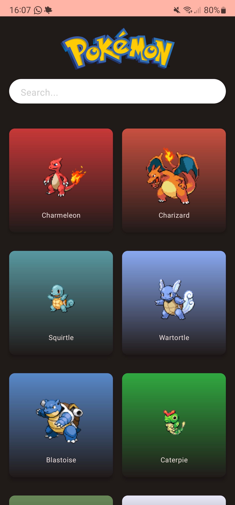
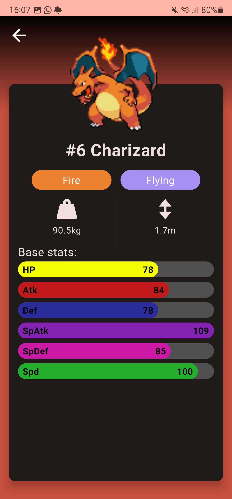

# PokeDex
Pokedex app with PokeAPI
# PokeDex app with PokeAPI

The Pokedex app is an easy to use app that displays the a list of all the top Pokemons. The app uses the PokeAPI to fetch the data and display it in a list.

I made this app following the tutorial from [Coding](https://www.youtube.com/watch?v=v0of23TxIKc&list=PLQkwcJG4YTCTimTCpEL5FZgaWdIZQuB7m). So I could improve my skills in Android Studio, Kotlin and clean architecture.

## Features
- PokeAPI to fetch the data
- Information about the Pokemon
- Clean architecture

